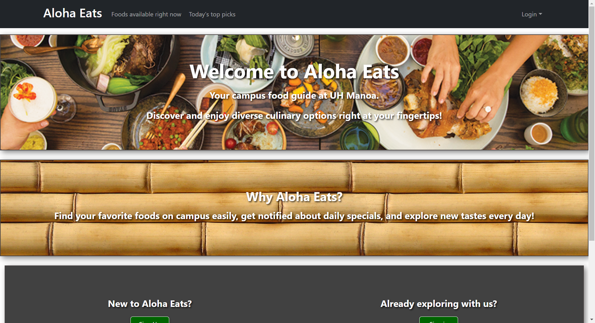
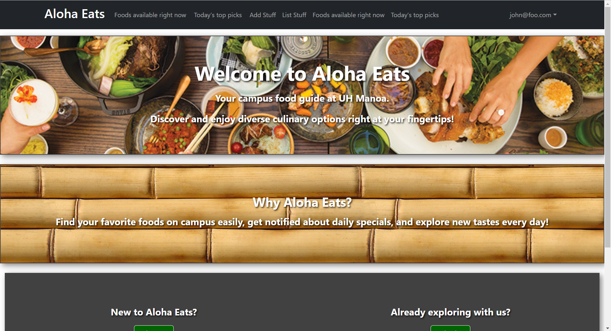
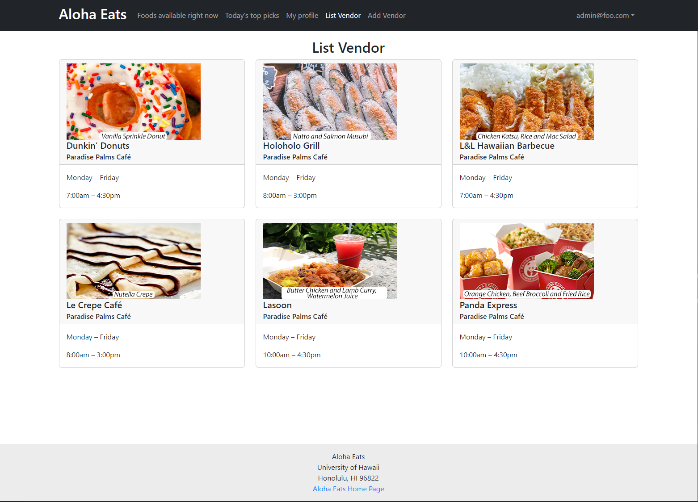
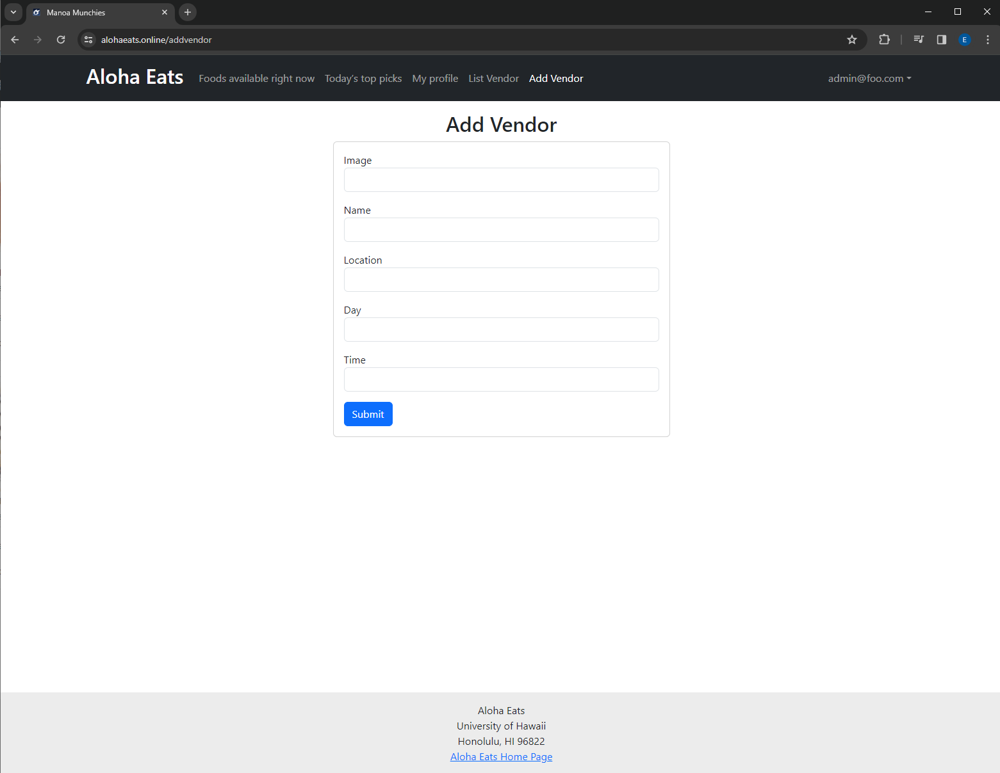
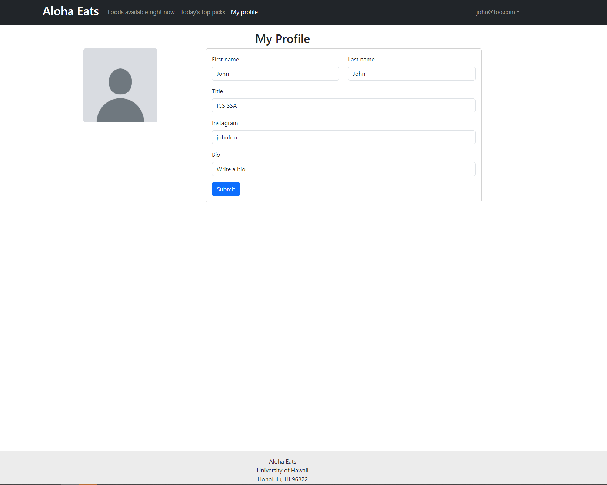

# Aloha Eats

## Table of contents

* [Overview](#overview)
* [Deployment](#deployment)
* [User Guide](#user-guide)
* [Community Feedback](#community-feedback)
* [Developer Guide](#developer-guide)
* [Development history](#development-history)
* [Contact Us](#contact-us)

## Overview

Aloha Eats is a web application that allows users to login and view all of the different food options on campus. You can see what is currently available on that day to eat, as well as filter out specific food options based on your preferences. Aloha Eats also allows vendors to login and upload relevant information to raise awareness for their business.

Link to the Aloha Eats GitHub organization page:  [https://github.com/ManoaMunchies](https://github.com/ManoaMunchies)

## Deployment

This is the link to the website: [https://alohaeats.online/](https://alohaeats.online/)

## User Guide

### Landing Page

The landing page is presented to users when they visit the top-level URL to the site. Users are greeted with some basic information on the website and given the option to register or login to the site.



### User home page

The user home page is similar to the landing page except there are several more options in the navbar. Two extra pages show up, that being the 'Foods available right now' and 'Today's top picks' pages.



### Vendor home page



### Admin home page


### Add Vendor page



### User profile page



### Foods available right now page

/sample text/

### Today's top pics page

/sample text/

## Community Feedback

/sample text/

## Developer Guide

This section provides information of interest to Meteor developers wishing to use this code base as a basis for their own development tasks.

### Installation

First, [install Meteor](https://www.meteor.com/install).

Second, visit the [Aloha Eats application github page](https://github.com/ManoaMunchies/manoa-munchies), and click the "Use this template" button to create your own repository initialized with a copy of this application. Alternatively, you can download the sources as a zip file or make a fork of the repo.  However you do it, download a copy of the repo to your local computer.

Third, cd into the manoa-munchies/app directory and install libraries with:

```
$ meteor npm install
```

Fourth, run the system with:

```
$ meteor npm run start
```

If all goes well, the application will appear at [http://localhost:3000](http://localhost:3000).

### Application Design

Aloha Eats is based upon [meteor-application-template-react](https://ics-software-engineering.github.io/meteor-application-template-react/) and [meteor-example-form-react](https://ics-software-engineering.github.io/meteor-example-form-react/). Please use the videos and documentation at those sites to better acquaint yourself with the basic application design and form processing in Aloha Eats.

## Development History

Showcase of our development on this project over time. We will have project pages that contain the issues that are to be worked on during the respective milestone.

### Milestone 1

In milestone 1 we primarily focused on creating the landing page and making mockups of several other pages. Providing some groundwork for us to develop this project efficiently. As well as having this site fully updated and ready for documentation on then next milestone.

Link to our M1 Project page: [https://github.com/orgs/ManoaMunchies/projects/1](https://github.com/orgs/ManoaMunchies/projects/1)

### Milestone 2

In milestone 2 we are going to focus on the more important and complex components of our project.

Link to our M2 Project page: [https://github.com/orgs/ManoaMunchies/projects/2](https://github.com/orgs/ManoaMunchies/projects/2)

### Milestone 3

In milestone 3...

Link to our M2 Project page:

## Contact Us

Our team name is Aloha Eats and our members consist of:

* River Matsumoto
* Will Dwight
* Hoang Nguyen
* Joseph Heintz

Link to our [team contract](https://docs.google.com/document/d/1fF6NeVbebsoYr12UiWiHV_tHTKIU4gOcggkx3lGCNm0/edit?usp=sharing).
