# Aloha Eats

## Table of contents

* [Overview](#overview)
* [Deployment](#deployment)
* [User Guide](#user-guide)
* [Community Feedback](#community-feedback)
* [Developer Guide](#developer-guide)
* [Development history](#development-history)
* [Contact Us](#contact-us)

## Overview

Aloha Eats is a web application that allows users to login and view all of the different food options on campus. You can see what is currently available on that day to eat, as well as filter out specific food options based on your preferences. Aloha Eats also allows vendors to login and upload relevant information to raise awareness for their business.

Link to the Aloha Eats GitHub organization page:  [https://github.com/ManoaMunchies](https://github.com/ManoaMunchies)

## Deployment

This is the link to the website: [https://alohaeats.online/](https://alohaeats.online/)

## User Guide

### Landing Page

The landing page is presented to users when they visit the top-level URL to the site. Users are greeted with some basic information on the website and given the option to register or login to the site.


### User Profile page

The user profile page displays all the information pertaining to the user that is currently logged in. You may also edit the information on your page like name, bio, etc.

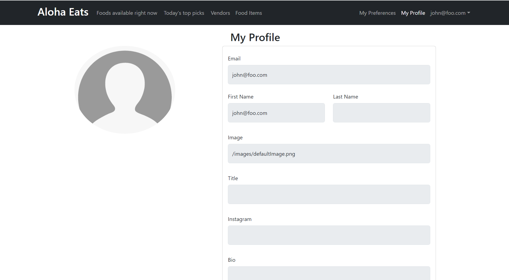

## My Preferences page

The my preferences page allows users to filter out food options based on their preferences. You can filter out food options based on the type of cuisine and any dietary restrictions one might have.

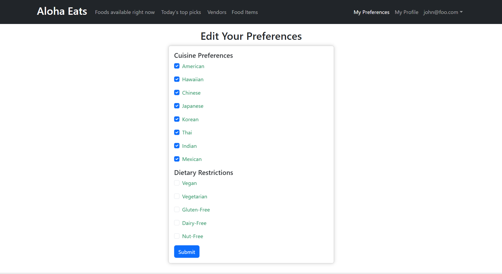

### Foods available right now page

This page displays all the food options that are available at the current time and date. You can also filter out the food options based on your preferences.

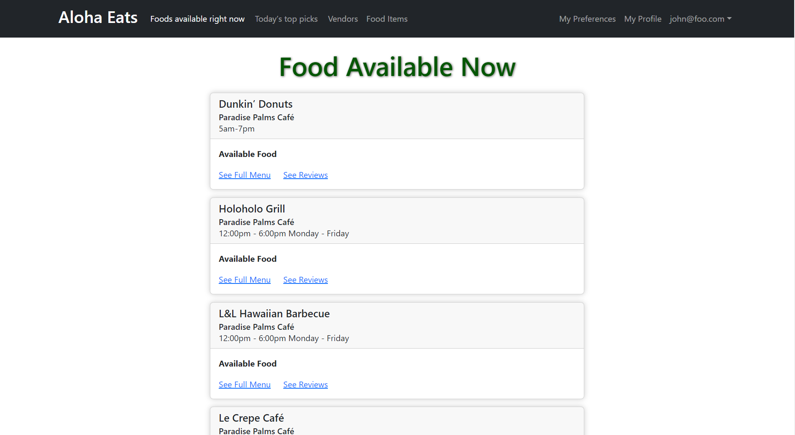

## Vendor Map Location Page

When you click on the 'See Location on Map' link on the foods available right now page, it will take you to the vendor map location page. This page displays the location of the vendor on a map. A pin is placed on the approximate location of the vendor, along with the google maps address.


### Today's top picks page

The top picks page shows the most popular food options based on reviews. Making the most popular food options more visible to users.

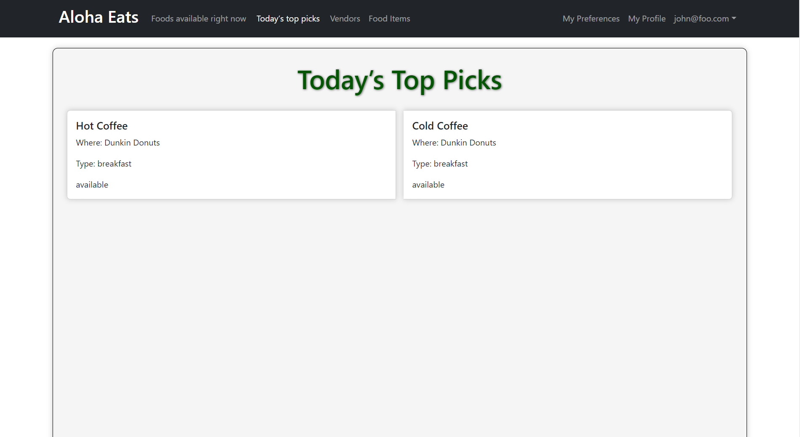

### List vendor page

This page has a collection of cards that display an image of potential food options, the name, location, and available times of each different vendor. You can click on any of the vendors to view their full menu, map location, or reviews that they have.

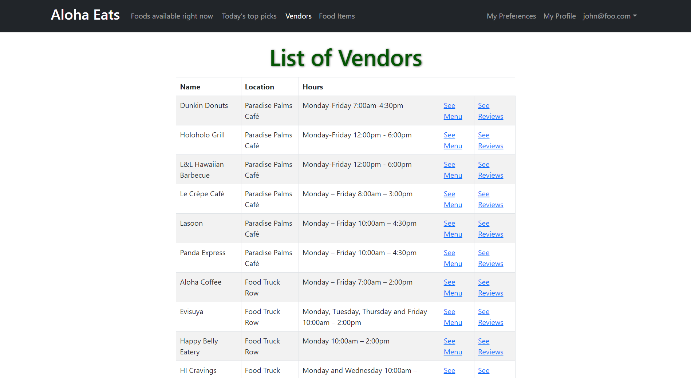

## Food Items Page

The food items page displays all the food items that are currently available from all vendors. There is table that has columns labeled name, cuisine type, vendor, and availability.

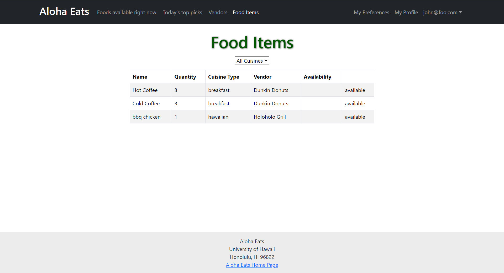

## Vendor Home Page

The vendor home page is where vendors can edit their information and menu, as well as see their reviews.


## Vendor Menu Page

The vendor menu page displays all the food items that are currently available from that specific vendor. It contains a picture and relevant information to each menu item. You can also add, edit, or delete any of the new or existing menu items.

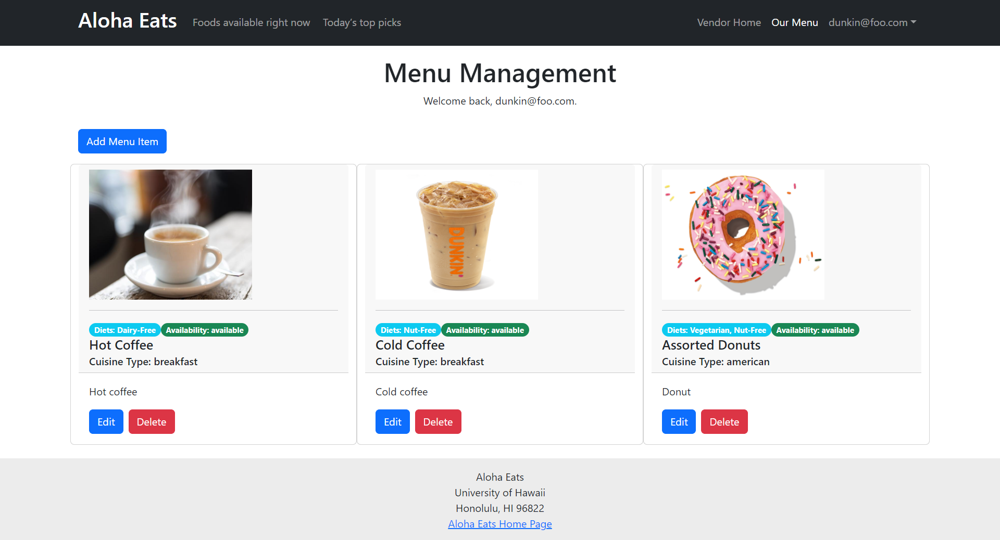

### Admin Panel

Any admins have access to the admin panel which displays vendor information and all active accounts. On this admin panel you can edit the vendor information or menu. You can also edit the role of any accounts, as well as remove them if desired. 

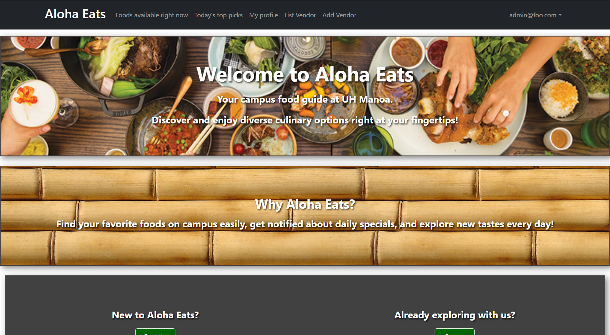

Selecting "Edit Menu" for a vendor takes you to another page where you can edit, delete, or add a menu item for that specific vendor. 

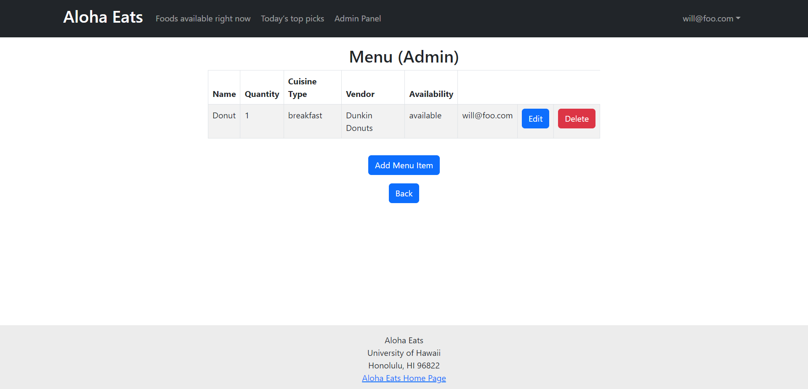

## Community Feedback

## Developer Guide

This section provides information of interest to Meteor developers wishing to use this code base as a basis for their own development tasks.

### Installation

First, [install Meteor](https://www.meteor.com/install).

Second, visit the [Aloha Eats application github page](https://github.com/ManoaMunchies/manoa-munchies), and click the "Use this template" button to create your own repository initialized with a copy of this application. Alternatively, you can download the sources as a zip file or make a fork of the repo.  However you do it, download a copy of the repo to your local computer.

Third, cd into the manoa-munchies/app directory and install libraries with:

```
$ meteor npm install
```

Fourth, run the system with:

```
$ meteor npm run start
```

If all goes well, the application will appear at [http://localhost:3000](http://localhost:3000).

### Application Design

Aloha Eats is based upon [meteor-application-template-react](https://ics-software-engineering.github.io/meteor-application-template-react/) and [meteor-example-form-react](https://ics-software-engineering.github.io/meteor-example-form-react/). Please use the videos and documentation at those sites to better acquaint yourself with the basic application design and form processing in Aloha Eats.

## Development History

Showcase of our development on this project over time. We will have project pages that contain the issues that are to be worked on during the respective milestone.

### Milestone 1

In milestone 1 we primarily focused on creating the landing page and making mockups of several other pages. Providing some groundwork for us to develop this project efficiently. As well as having this site fully updated and ready for documentation on then next milestone.

Link to our M1 Project page: [https://github.com/orgs/ManoaMunchies/projects/1](https://github.com/orgs/ManoaMunchies/projects/1)

### Milestone 2

In milestone 2 we focused on the more important and complex components of our project. We added the ability to edit your user profile, list vendors, and add vendors. Additionally, there is now a vendor home page and admin panel where these roles can manage relevant data.

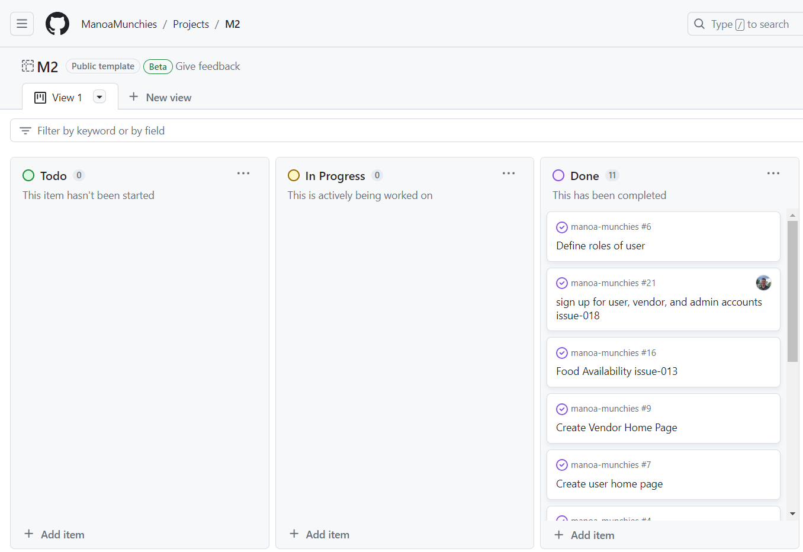

Link to our M2 Project page: [https://github.com/orgs/ManoaMunchies/projects/3](https://github.com/orgs/ManoaMunchies/projects/3)

### Milestone 3

In milestone 3 we will aim to finish up the last few pages, mainly the foods available right now and today's top picks page. As well as correctly enabling vendors to access the page and update their relevant information. We will also create a user preferences database collection so that users can filter vendors and menu items. When these functionalities are done, we will improve the UI and styling of the webpage, and integrate twitter and google maps.

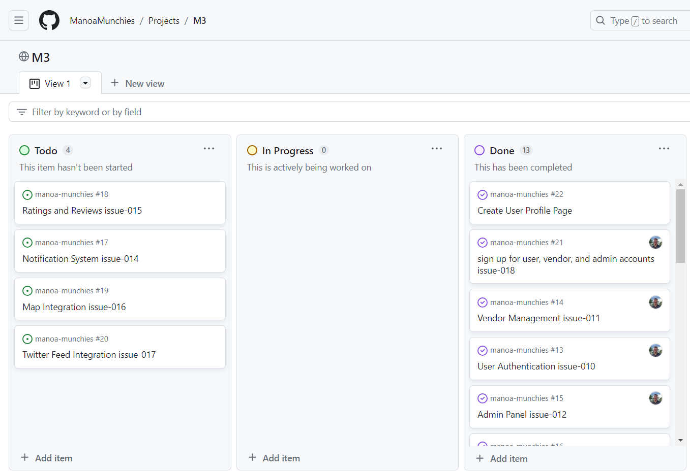

Link to our M3 Project page: [https://github.com/orgs/ManoaMunchies/projects/6](https://github.com/orgs/ManoaMunchies/projects/6)

## Contact Us

Our team name is Aloha Eats and our members consist of:

* River Matsumoto
* Will Dwight
* Hoang Nguyen
* Joseph Heintz

Link to our [team contract](https://docs.google.com/document/d/1fF6NeVbebsoYr12UiWiHV_tHTKIU4gOcggkx3lGCNm0/edit?usp=sharing).
