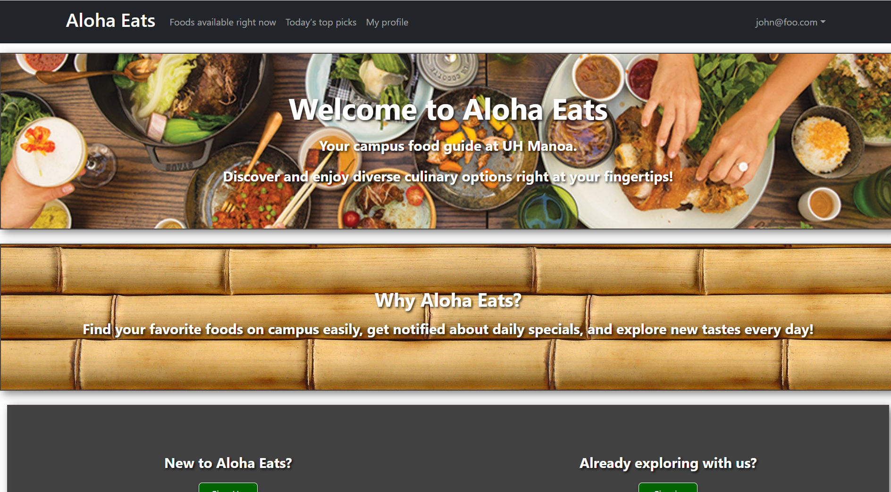

# Aloha Eats

## Table of contents

* [Overview](#overview)
* [Deployment](#deployment)
* [User Guide](#user-guide)
* [Community Feedback](#community-feedback)
* [Developer Guide](#developer-guide)
* [Development history](#development-history)
* [Contact Us](#contact-us)

## Overview

Aloha Eats is a web application that allows users to login and view all of the different food options on campus. You can see what is currently available on that day to eat, as well as filter out specific food options based on your preferences. Aloha Eats also allows vendors to login and upload relevant information to raise awareness for their business.

Link to the Aloha Eats GitHub organization page:  [https://github.com/ManoaMunchies](https://github.com/ManoaMunchies)

## Deployment

This is the link to the website: [https://alohaeats.online/](https://alohaeats.online/)

## User Guide

### Landing Page

The landing page is presented to users when they visit the top-level URL to the site.

### User home page

/sample text/

### Vendor home page

/sample text/

### Admin home page

/sample text/

### Add Vendor page

/sample text/

### User profile page

/sample text/

### Foods available right now page

/sample text/

### Today's top pics page

/sample text/

## Community Feedback

/sample text/

## Developer Guide

/sample text/

## Development History

/sample text/

Link to our M1 Project page: [https://github.com/orgs/ManoaMunchies/projects/1](https://github.com/orgs/ManoaMunchies/projects/1)

Link to our M2 Project page: [https://github.com/orgs/ManoaMunchies/projects/2](https://github.com/orgs/ManoaMunchies/projects/2)

## Contact Us

/sample text/

Link to our [team contract](https://docs.google.com/document/d/1fF6NeVbebsoYr12UiWiHV_tHTKIU4gOcggkx3lGCNm0/edit?usp=sharing)
